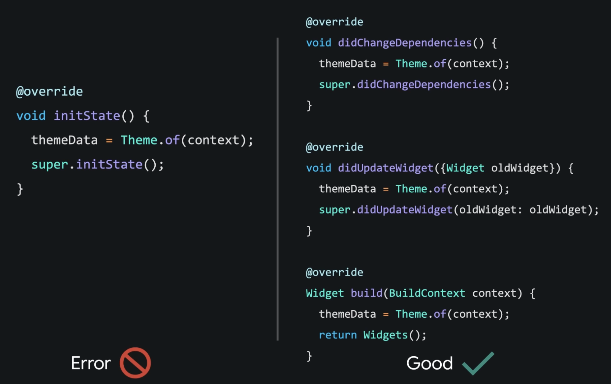
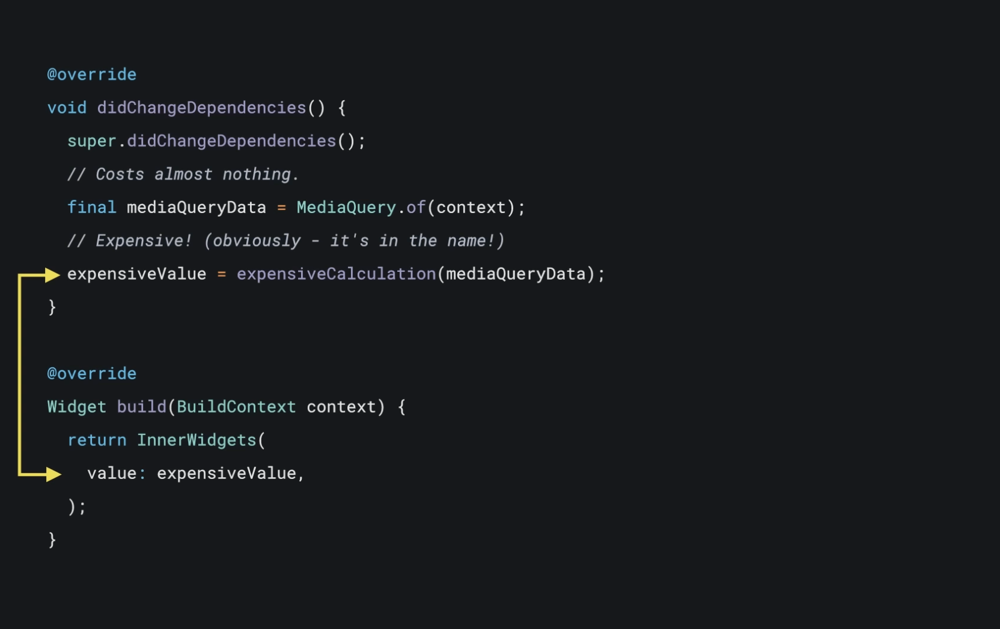

## Жизненный цикл виджетов

Начнем с простого.

### StatelessWidget

Для работы нам нужны:

1. Конструктор
2. build

Обновление виджета могут запустить следующие события:
1. Виджет вставляется в дерево виджетов в первый раз.
2. Изменяется состояние зависимостей.
3. Приходят новые параметры виджета от родителя (меняется конфигурация виджета).

### StatefulWidget

Когда Flutter создает StatefulWidget, он создает State объект. В этом объекте хранятся все изменяемые состояния для виджета.

Жизненный цикл состоит из следующих основных шагов:

*  createState()
*  initState()
*  didChangeDependencies()
*  build()
*  didUpdateWidget()
*  deactivate()
*  dispose()

#### createState()
При создании виджета для него сразу создается объект стейта.

После создания объекта состояния и перед вызовом initState фреймворк «монтирует» объект состояния, связывая его с BuildContext (место виджета в дереве). Стейт остается смонтированным до тех пор, пока фреймворк не вызовет dispose.

Находится ли он в дереве можно узнать с помощью гетера mounted.

#### initState()
initState() вызывается когда объект вставляется в дерево - только один раз.  Здесь выполняется инициализация переменных, различных контроллеров, подписка на потоки и т.п.

#### didChangeDependencies()
Вызывается первый раз при создании объекта сразу после initState.

Если объект состояния зависит от унаследованного виджета, который изменился, то этот метод будет вызван повторно.

#### build() сборка()
Затем фреймворк вызывает build() который должен возвращать часть пользовательского интерфейса, представленную этим виджетом.

Фреймворк вызывает этот метод в нескольких различных ситуациях. Например:
* После вызова  initState .
* После вызова  didUpdateWidget .
* После получения вызова setState.
* После изменения зависимости этого объекта состояния.
* После вызова деактивировать, а затем повторно вставить объект состояния в дерево в другом месте.

#### didUpdateWidget(Widget oldWidget)
Вызывается всякий раз, когда изменяется конфигурация виджета. В этом случае мы получаем oldWidget экземпляр в качестве параметра, чтобы можно было сравнить его с текущим виджетом и выполнить любую дополнительную логику.

При выполнении дополнительной логики платформа всегда вызывает build после вызова didUpdateWidget, поэтому вызывать setState в didUpdateWidget не требуется.

#### deactivate()
Деактивация вызывается, когда состояние удаляется из дерева, но оно может быть повторно вставлено до завершения текущего изменения кадра. Этот метод существует в основном потому, что объекты состояния можно перемещать из одной точки дерева в другую.

#### dispose()
Когда навсегда удаляется объект и его состояние из дерева. Необходим для очистки памяти, например, для отмены подписки на потоки и удаления анимации или контроллеров.

**setState()**
Этот метод часто вызывается из самого фреймворка и разработчиками для уведомления платформы об изменении данных.

Наиболее часто используемые разработчиками методы:
initState, build, setState и dispose.

- - - -
## Примеры применения на практике

Если сложностей с пониманием  initState(), dispose() и setState() обычно не возникает, то новичкам не всегда понятно как использовать  didChangeDependencies() и didUpdateWidget(Widget oldWidget).

### didChangeDependencies()

Можно выполнять дорогостоящие операции от результата которых зависит внутренний виджет.

Полезные видео:

[InheritedWidgets | Расшифровка Flutter](https://youtu.be/og-vJqLzg2c)

[Синхронный BuildContexts | Расшифровка Flutter](https://youtu.be/bzWaMpD1LHY)

### didUpdateWidget(Widget oldWidget)

Как правило, делают обновление данных контроллеров, отменяют подписку на старые объекты и подписываются на новые, выполняют другую необходимую логику.

Пример можно посмотреть в коде проекта.

Пример в документации: [didUpdateWidget method - EditableTextState class - widgets library - Dart API](https://api.flutter.dev/flutter/widgets/EditableTextState/didUpdateWidget.html)